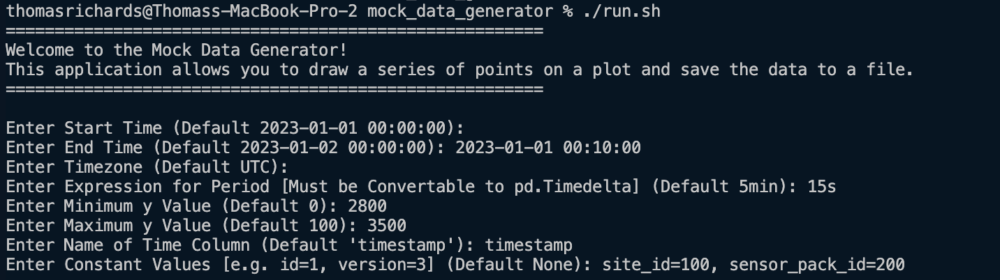
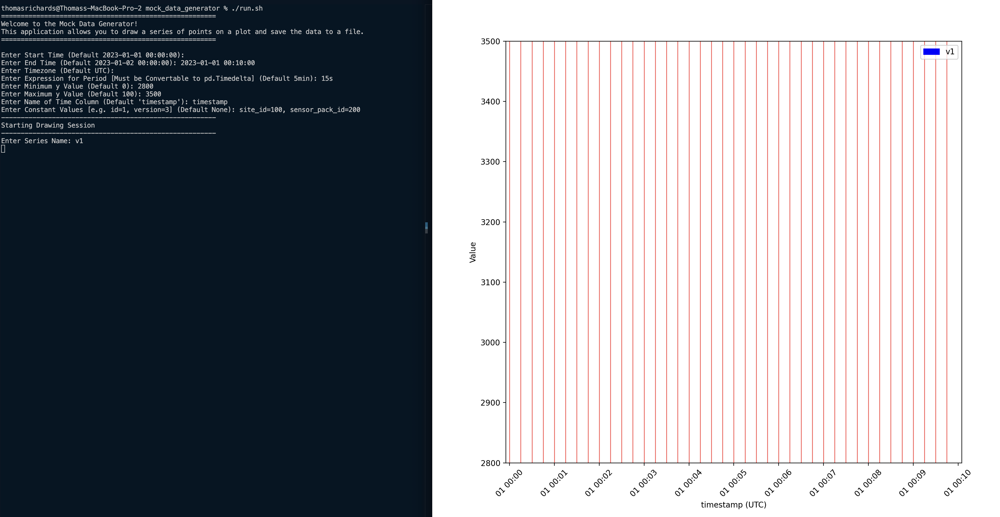
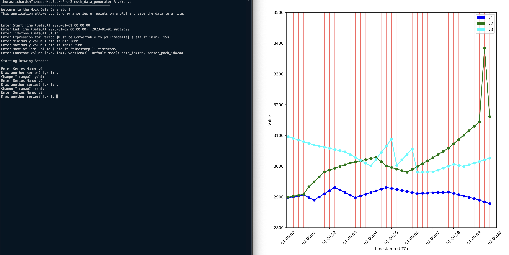
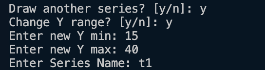
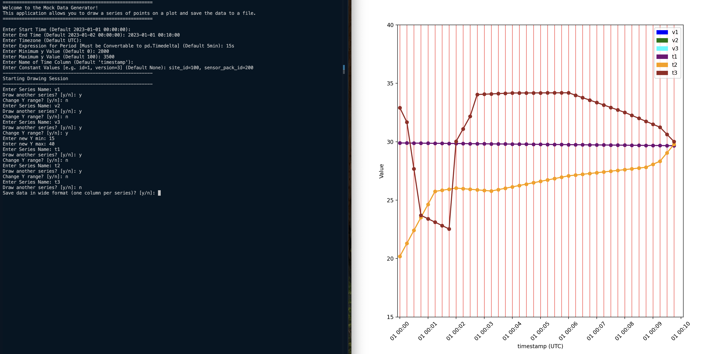
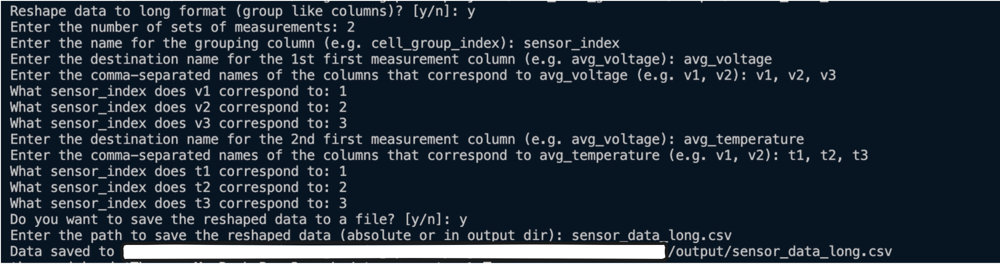

# Mock Data Generator for Time Series

## Overview

The Mock Data Generator is a Python-based tool designed to create synthetic time series data suitable for testing and development purposes. It allows users to generate datasets that resemble real-world data (or not) without being limited to customer data that already exists.

## Features

- **Interactive Data Generation**: Users can interactively draw the desired time series patterns, which are then converted into a structured dataset.  Multiple time series can be drawn at once and included in the same dataset.  As long as these timeseries are numeric, there are no constraints around frequency, range, or number of series.
- **Multiple Time Series Support**: It allows for the generation of multiple time series, which can be superimposed on a single canvas in different colors.
- **Customizable Time Range**: Users can specify the time range and resolution (period) for the time series data.
- **Export to CSV**: The generated time series data can be saved into a CSV file, making it easy to use in various applications.  Both long and wide formats are available for export.

## System Requirements

- Python 3.8 or higher
- [Poetry](https://python-poetry.org/) for dependency management

## Setup

1. Clone the repository with your preferred method.  For example, using HTTPS:

   ```bash
   git clone https://github.com/TCRichards/mock_data_generator.git
   ```

1. Navigate to the `mock_data_generator` folder:

   ```bash
   cd mock_data_generator
   ```

2. Install dependencies with Poetry:

   ```bash
   poetry install
   ```

3. Run the entrypoint:

   ```bash
   ./run.sh
   ```

## Walkthrough For Generating Mock Timeseries Data

Let's say we want to created simulated data for a group of 3 sensors that read both voltage and temperature data.
The following steps describe how you might create 10-minute-long voltage and temperature timeseries for 3 sensors.

1. Run the entrypoint

   ```bash
   ./run.sh
   
   OR

   poetry run python mock_data_generator/main.py
   ```

2. Use the command line to provide arguments to the script.
   1. We'll run for 10 minutes at 15-second frequency.
   2. We'll start by generating the voltage data in mV, and set the y-range between 2800 and 3500.
   3. Let's assume these sensors all share the same a `site_index` and a `sensor_pack_index`, but are distinguished by a `sensor_index`.  The `site_index` and `sensor_pack_index` are constant columns which you'll be prompted to set using a comma-separated list of assignments (e.g. `site_index=100, sensor_pack_index=200`).
.

3. You'll be prompted to provide a name for the first timeseries.  Name it "v1".  Afterwards, an interactive canvas will appear where you can click to draw values for the series at the allowed x intervals.



4. Draw v1 to completion.  When prompted if you want to draw another series, select "y", and select "n" when asked if you want to change the y-range (since you still have more voltage series to draw).

5. Create 2 more voltage timeseries named "v2" and "v3".

.

6. Now we're going to start drawing temperature data.  Select "y" to draw another timeseries, and select "y" again to change the y-range to a more reasonable temperature range in Celsius.  We'll draw from 15 to 40 degrees C.



7. Draw 3 timeseries for temeperatures, named "t1", "t2", and "t3".
.

8. You'll be prompted if you want to save the data in wide format.
   1. Wide format means that each timeseries gets its own column, so in our case the result would have columns ["v1", "v2", "v3", "t1", "t2", "t3"] (plus the constant columns we set at the beginning).
   2. Next, you'll be prompted whether to store the result in long format, which you should say yes to.

9. To reshape the data into long format, you'll need to provide the name of the grouping column (in our case `sensor_index`) and provide a mapping between the timeseries and their group. Remember that we have 2 sets of measurements (voltage and temperature).  Here's an example set of responses:


10.  In the `output/` folder, you should see files in both the long and wide format that contain your timeseries.  We're including a sample of each format in the `examples/` folder.
   - `examples/sensor_data_wide.csv`
   - `examples/sensor_data_wide.csv`
